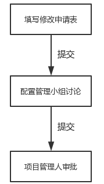
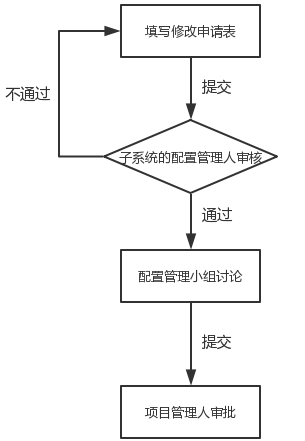
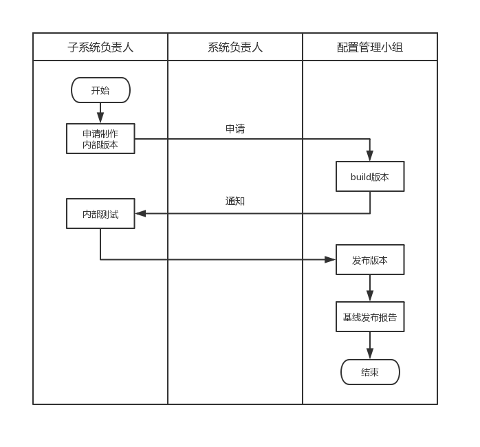

H2H-Doc-SCMP-v2.0

软件配置管理计划
================

**Version： 2.0.0**

>   编写： *孟奇一，曲建旭*

>   校对： *孟奇一*

>   审核： *李宁生*

>   批准： *卢延悦*

>   **西北工业大学H2H小组**

>   **2019年7月**

**修订记录**

| **版本号** | **修订时间** | **修订内容**             | **提出人** | **审核人** | **是否通过** |
|------------|--------------|--------------------------|------------|------------|--------------|
| 1.1        | 7.3          | 修改了部分需求规格，以及 | 孟奇一     | 李宁生     | 是           |
|            |              |                          |            |            |              |
|            |              |                          |            |            |              |
|            |              |                          |            |            |              |
|            |              |                          |            |            |              |
|            |              |                          |            |            |              |

**审核记录**

| **审核版本号** | **审核时间** | **审核内容**                 | **审核问题**                         | **审核人** | **是否通过** |
|----------------|--------------|------------------------------|--------------------------------------|------------|--------------|
| 1.0.0          | 7.2          | SCMP是否完善                 | 部分文档格式不正确                   | 李宁生     | 是           |
| 1.0.0          | 7.6          | 审核SCMP第二阶段是否符合要求 | 部分使用工具发生了改变，需要进行修改 | 李宁生     | 是           |
|                |              |                              |                                      |            |              |
|                |              |                              |                                      |            |              |
|                |              |                              |                                      |            |              |
|                |              |                              |                                      |            |              |

1引言
=====

1.1标识
-------

本计划的目的在于对所开发的H2H软件规定各种必要的配置管理条款，以保证所交付的H2H软件能够满足项目要求中规定的各种原则需求，能够满足本项目所有负责人制定且经过组长批准的软件系统需求规格说明书中规定的各项具体需求。

软件开发人员在开发本项目所属的各子系统（其中包括为本项目研制或选用的各种支持软件）时，都应该执行本计划中的有关规定，但可以根据各自的情况对本计划作适当的剪裁，以满足特定的配置管理需求，剪裁后的计划必须经所有项目负责人批准。

1.2系统概述
-----------

本条应简述本文档适用的系统和软件的用途。它应描述系统与软件的一般性质；概述系统开发、运行和维护的历史；标识项目的投资方、需方、用户、开发方和支持机构；标识当前和计划的运行现场；并列出其他有关文档。

1.3文档概述
-----------

本文档是通过技术或行政手段对软件产品及其开发过程和生命周期进行控制、规范的一系列措施。配置管理的目标是记录软件产品的演化过程，确保软件开发者在软件生命周期中各个阶段都能得到精确的产品配置。本文档由小组的配置管理人员完成，后续的配置管理更改由软件开发人员发起，经由软件总体负责人审核批准后，由配置管理人员进行跟踪、统计、备份等。

1.4组织和职责
-------------

在软件配置管理小组中，各类人员要互相配合、分工协作，共同担负起整个项目的软件配置管理工作。其中各类人员的分工如下：

①组长是项目总体负责人，他对有关软件配置管理的各项工作全面负责，特别要对更改建议的审批和评审负责。

②软件工程小组组长负责监督在软件配置管理工作中认真执行软件工程规范。

③项目的专职配置管理人员检查在做配置更改时的质量保证措施。

④各子系统的配置管理人员具体负责实施各自的配置管理工作，并参与各子系统等功能配置检查和物理配置检查。

⑤项目专职的配置管理人员协助组长开展各项软件配置管理活动，负责审查所有采用的配置管理工具、技术和方法，并负责汇总、维护和保存有关软件配置管理活动的各项记录。

2引用文件
=========

GB/T 11457 软件工程术语

GB 8566 计算机软件开发规范

GB 8567 计算机软件产品开发文件编制指南

GB/T 12504 计算机软件质量保证计划规范

GB/T 12505 计算机软件质量保证计划规范

3管理
=====

3.1机构
-------

在本软件系统整个开发过程中，必须成立软件配置管理小组负责配置管理工作。软件配置管理小组由项目管理人、各软件小组组长、各个子系统的软件配置管理人员组成，其中由项目管理人担任软件配置管理小组的组长。软件配置管理小组必须检查和监督本计划的实施。各子系统的软件配置管理人员有权直接向软件配置管理小组报告子项目的软件配置管理情况。各子系统的软件配置管理人员应该根据对子项目的具体要求，制定必要的规程和规定，以确保完全遵守本计划规定的所有要求。

3.2任务
-------

在软件工程化生产的各个阶段中，与本阶段的阶段产品有关的全部信息存放在软件开发库中，与前面各个阶段的阶段产品有关的信息则存放在软件受控库中。其中软件开发库由本阶段的开发小组管理，而软件受控库由项目管理配置小组管理，这样，在本阶段的开发过程中，开发小组有权对阶段产品做必要的修改；但是如果开发小组认为有必要对前面有关阶段的阶段产品做修改时，就必须获得项目管理配置小组的审批。软件经过组装与系统测试后，应送入软件产品库，如欲对其进行修改，必须经配置管理小组和项目管理人的审批通过。

3.3职责
-------

在软件配置管理小组中，各类人员要互相配合、分工协作，共同担负起整个项目的软件配置管理工作。其中各类人员的分工如下：

①组长是项目总体负责人，他对有关软件配置管理的各项工作全面负责，特别要对更改建议的审批和评审负责。

②软件工程小组组长负责监督在软件配置管理工作中认真执行软件工程规范。

③项目的专职配置管理人员检查在做配置更改时的质量保证措施。

④各子系统的配置管理人员具体负责实施各自的配置管理工作，并参与各子系统等功能配置检查和物理配置检查。

⑤项目专职的配置管理人员协助组长开展各项软件配置管理活动，负责审查所有采用的配置管理工具、技术和方法，并负责汇总、维护和保存有关软件配置管理活动的各项记录。

3.4接口控制
-----------

对各类接口进行严格、合理的控制，是软件配置管理中最重要的任务之一。整个软件项目及其各子系统都必须对其进行严格的控制，在工程化软件系统中，主要的接口有以下四类：

①用户界面：用户界面是指各子系统与软件操作人员之间的操作约定，同时还指实现这些操作约定的功能和性能特性。

②系统内部接口：系统内部接口是指各子系统在集成为一个总的软件系统时的各种连接约定。

③标准程序接口：标准程序接口是指各应用子系统与标准子程序库之间的调用约定。

④软件接口：软件接口是指各个子系统与计算机上的系统软件以及与调用本软件的其它软件系统之间的连接约定。

以上四类接口是一个软件系统各项配置的重要组成部分。对接口修改进行合理的控制是软件配置管理的重要任务之一。这四类接口都涉及到本软件系统的全局，因此，当要求对这四类接口中任意一类借口进行修改时，都必须办理正规的审批手续，最后要经项目总体组批准。在接口完成修改后，软件配置管理小组要对修改后的软件系统活动进行跟踪，避免接口修改出现问题。

3.5实现
-------

在实现软件配置管理计划的过程中，要实现以下三个里程碑：

a.建立软件配置管理小组：在项目管理人批准软件配置管理计划之后，立即成立软件配置管理小组；

b.建立各阶段的配置基线：在H2H软件系统及其所属各子系统任务书编写完成并进行评审和批准后，建立功能基线；在《H2H软件需求规格说明书》编写完成并批准后，建立指派基线；在H2H软件系统的集成与系统测试完成后，建立产品基线；

c.建立软件库：在本项目的各个子系统开发工作的开始，就建立起各个子系统的软件开发库，并建立起有关系统及其子系统的软件受控库；

d.建立控制接口协议。

3.6适用的标准、条例和约定
-------------------------

### 3.6.1指明所适用的软件配置管理标准、条例和约定

GB/T 11457 软件工程术语

GB 8566 计算机软件开发规范

GB 8567 计算机软件产品开发文件编制指南

GB/T 12504 计算机软件质量保证计划规范

GB/T 12505 计算机软件质量保证计划规范

### 3.6.2描述要在本项目中编写和实现的软件配置管理标准、条例和约定

本项目应该遵守如下标准、条例和约定：

a.软件开发库、软件产品库的操作规程与管理规程。

b.系统、子系统、模块、和程序单元的命名约定。

c.文档和测试用例的命名和管理规程。

这些命名约定，操作规程和管理规程应由本项目技术组负责制定，并应认真听取各子系统项目负责人的意见，最后报项目总体组审批。在执行过程中，如果发现某些条款需要修改，则必须办理正规的审批手续，最后要经项目总体组批准。

4软件配置管理活动
=================

4.1配置标识
-----------

### 4.1.1本条必须详细说明软件项目的基线(即最初批准的配置标识)

所有属于本项目及其各子系统的各类基线，首先要按照计划书、软件需求规格说明书、软件设计说明书中的规定确定其技术内容，在整个软件项目开发过程中定义以下两类基线：

①文档基线：本项目的文档基线的定义以里程碑的定义为准，将到达各阶段的里程碑时的文档作为基线。

②产品基线：产品基线包括两个，一是系统上线时，二是系统经过客户验证测试时，基线包含所有程序代码和文档。

配置管理员负责在项目开发的每一个里程碑处、每一个阶段性的版本发布时负责为整个配置库设立书签，划定配置管理基线，并以文档的方式记录下这些书签的定义。

基线的命名规范为：[项目名称]-[子系统名]-[文档名称]-[版本号]

若没有子系统可以忽略子系统名。

### 4.1.2本条必须描述本项目所有软件代码和文档的标题、代号、编号以及分类规程

本项目的软件代码和文档的命名规范由4个字段组成，从左到右依次为：项目名、类型、名称、版本号，字段之间由横线”-”分隔。

[项目名称]-[类型]-[名称]-[版本号]

其中项目名称最长10个字符，类型最长5个字符，编号最长10个字符，版本号为V m.n构成。

4.2配置控制
-----------

**4.2.1本条必须描述在本计划3.2条描述的软件生存周期中各个阶段使用的修改批准权限的级别.**

①A类修改：对本项目各个子系统及其专用支持软件的功能基线、指派基线、产品基线及其集成系统的任何修改，都必须通过项目配置管理小组讨论，并经过项目管理人批准。

②B类修改：对本项目各个子系统及其专用支持软件的其它阶段产品的任何修改，都必须通过本项目各个子系统的配置管理人审查，并经项目的软件配置管理小组与项目管理人的批准。

### 4.2.2本条必须定义对已有配置的修改申请进行处理的方法

A类修改：

B类修改：

### 4.2.3对于各个不同层次的配置控制组和其他修改管理机构

①子系统配置管理小组：由各个子系统的配置管理人组成，负责B类修改时的最初审查

②总体配置管理小组：由项目配置管理小组承担，负责A类修改的审查和获得子系统配置管理小组批准的B类修改的审查。

4.3配置状态的记录和报告
-----------------------

利用软件问题报告单和软件修改报告单对项目子系统及其支持的软件配置状态进行记录和追踪，对软件问题报告单和软件修改报告单的记录和追踪应由软件配置管理工资东实现，用户可通过该软件系统进行查询。

对于收集的具体配置状态信息有以下要求：

①为了基线和变更，哪些数据元素被追踪和报告了。

②生成了哪种状态统计报告类型，和它们的生成频率。

③信息怎样被收集、存储、处理和报告。

④受控的如何访问状态数据。

如果一个系统作为状态统计活动，必须描述或引用它的功能。

对于每个项目配置项，至少下列数据元素是必须被记录和报告的：它的初始化认可版本，请求变更的状态和认可变更的状态。细节的级别和需求的特定数据可能因为项目和客户的信息需求而变化。

4.4配置的检查和评审
-------------------

项目软件配置管理小组要对所有由第三方提供的软件进行物理配置检查，对本项目及其各个子系统的每一个新的功能进行功能配置检查和物理配置检查，对于宿主计算机系统所提供的软件和硬件配置要每隔一个月检查一次，在软件验收前要对宿主计算机系统、各个子系统以及专用支持软件的配置进行综合检查。

在软件开发周期的各阶段评审与检查工作中，要对该阶段所进行的配置管理工作进行必要的评审和检查，具体的审核内容如下表：

| 审核分类              | 审核内容                                                               | 检查情况 |
|-----------------------|------------------------------------------------------------------------|----------|
| 发布审核              | 发布文档是否清楚地定义了发布的范围，包括应被纳入的更改请求？           |          |
|                       | 所有已知缺陷是否已文档化？                                             |          |
|                       | 是否有适当的文档标识重建钙发布所需的环境（编译器版本，OS版本等）？     |          |
|                       | 是否有适当的文档说明构成该发布的成分以及成分的版本？                   |          |
|                       | 发布的所有项是否彼此同步？                                             |          |
|                       | 是否采用正确存储数据库中的正确成分的正确版本生成发布？                 |          |
| 存储数据库/配置项审核 | 存储数据库是否按H2H计划定义？                                          |          |
|                       | 项是否已经进入正确的库？                                               |          |
|                       | 是否按照H2H计划中规定的命名约定项命名？                                |          |
|                       | 是否按照H2H计划规定项目的版本号？                                      |          |
|                       | 是否按照H2H计划中规定的事件将所有项入库？                              |          |
|                       | 项是否有所要求的文档以识别项目、版本和更改历史？                       |          |
| 更改实施审核          | 是否全部所要求的更改请求均已结束？                                     |          |
|                       | 是否更改请求标识出全部拟更改的项？                                     |          |
|                       | 更改请求中所标识的全部要更改的项在更改后是否已入库？                   |          |
|                       | 是否可能在项目的任何两个版本中间区分更改？                             |          |
|                       | 项目的文档是否足够，能向后追踪更改到相应的更改请求？                   |          |
|                       | 是否有恰当方法能回到以前的版本？                                       |          |
| 审核的其他方面        | 是否对库作了恰当的备份？                                               |          |
|                       | 是否已测试过从备份中恢复？                                             |          |
|                       | 在群组成员的工作目录中是否有任何未经许可的成分？                       |          |
|                       | 是否有恰当的保密/批准手续以保证只有经授权的群组成员才能进行入库/出库？ |          |

5工具、技术和方法
=================

①Github：源代码和相关文件的管理工具，支持用户快速汇总、更新项目相关源文件。

②Junit：java测试框架，可显示程序的语句覆盖率和分支覆盖率，协作测试人员进行软件测试。

③Rational Rose：可视化建模工具，协助用户绘制流程图、数据流图和用例图等。

6对供货单位的控制
=================

H2H项目无第三方软件购买需求。

7记录的收集、维护和保存
=======================

①软件产品的源程序、测试数据、测试报告及其他相关文档应汇总并保存在Github上。

②为防止意外发生，应将软件产品的一份备份存于本地，并在项目结束后再保存6个月。

8配置项和基线
=============

8.1配置项命名规则
-----------------

| **配置项类型**           | **命名规则的说明**               |
|--------------------------|----------------------------------|
| 受控配置库中的配置项文档 | [项目名称]-[资料名称]-[撰写日期] |
| 非受控配置库文件         | [文件类型]-[文件名称]-[撰写日期] |
| 提交文档文件             | [项目名称]-[资料名称]-[撰写日期] |

8.2配置项的识别和基线的划分
---------------------------

列出识别到的所有配置项和所属的配置基线，并明确配置项的标识、作者(或负责人)和配置时间。

| **配置基线** | **配置项名称**     | **配置项标识**    | **作者/负责人**      | **配置时间** |
|--------------|--------------------|-------------------|----------------------|--------------|
| 文档基线     | 软件开发计划       | H2H-Doc-SDP-V1.0  | 李新博、黄韬         | 2019.7.2     |
| 文档基线     | 软件需求规格说明书 | H2H-Doc-SRS-V1.0  | 宋昌、李宁生、陆韬韬 | 2019.7.2     |
| 文档基线     | 软件配置管理计划   | H2H-Doc-SCMP-V1.0 | 孟奇一、曲建旭       | 2019.7.2     |
| 文档基线     | 软件设计说明       | H2H-Doc-SDD-V1.0  | 卢延悦、熊敏光       | 2019.7.2     |
| 文档基线     | 软件测试说明书     | H2H-Doc-STD-V1.0  |                      |              |
| 文档基线     | 软件用户手册       | H2H-Doc-SUM-V1.0  |                      |              |
| 产品基线     | 软件测试报告       | H2H-Pro-STR-V1.0  |                      |              |
| 产品基线     | 各子系统代码       | H2H-Pro-SC-V1.0   |                      |              |
| 产品基线     | 成果代码           | H2H-Pro-OC-V1.0   |                      |              |
| 产品基线     | 测试代码           | H2H-Pro-TC-V1.0   |                      |              |

8.3变更和发布
-------------

9备份
=====

配置管理小组每周整体备份一次配置库，保留4周以内的备份记录。

备份方式：存于移动硬盘中。

项目结束时，配置管理小组按规定对配置库进行归档。

附录
====

附录可用来提供那些为便于文档维护而单独出版的信息(例如图表、分类数据)。为便于处理，附录可单独装订成册。附录应按字母顺序(A，B等)编排。

附表

附表1: 产品发布清单
-------------------

**产品发布清单**

| 项目名称     |          | 项目标识 |          |          |          |              |   |
|--------------|----------|----------|----------|----------|----------|--------------|---|
| 发布范围     |          |          |          |          |          |              |   |
| 产品发布清单 |          |          |          |          |          |              |   |
| 序号         | 产品名称 | 所属基线 | 密级     | 版本号   | 是否收回 | 规定收回时间 |   |
|              |          |          |          |          |          |              |   |
|              |          |          |          |          |          |              |   |
|              |          |          |          |          |          |              |   |
|              |          |          |          |          |          |              |   |
|              |          |          |          |          |          |              |   |
|              |          |          |          |          |          |              |   |
| 发布列表     |          |          |          |          |          |              |   |
| 序号         | 发布人   | 发布日期 | 发布对象 | 回收日期 | 备注     |              |   |
|              |          |          | 姓名     | 所属部门 | 确认签名 |              |   |
|              |          |          |          |          |          |              |   |
|              |          |          |          |          |          |              |   |
|              |          |          |          |          |          |              |   |
|              |          |          |          |          |          |              |   |
|              |          |          |          |          |          |              |   |
|              |          |          |          |          |          |              |   |

项目标识：按照《标识规范》为项目分配的标识号

发布范围：产品发布到公司内外哪些部门

所属基线：随着项目的进展，产品当前配置到的项目基线

密级：绝密、机密、秘密、普通

发布对象:产品被发布到的责任人

附表2: 配置变更申请单
---------------------

**配置变更申请表**

| 1.项目(系统)名称：       |                     |       |   |
|--------------------------|---------------------|-------|---|
| 2.变更标识号：           | 3.基线类别：        |       |   |
| 4.申请人姓名：           | 5.申请日期：        |       |   |
| 6.变更描述：             |                     |       |   |
| 7.变更理由：             |                     |       |   |
| 评估                     |                     |       |   |
| 8.估计工时：             | 11.受影响配置项：   | 版本: |   |
| 9.需要资源：             |                     |       |   |
| 10.评估人： 日期         |                     |       |   |
| 变更批准                 |                     |       |   |
| 12.审批人： 意见： 日期  | 16.变更配置项:      | 版本: |   |
| 13.变更实施人： 日期：   |                     |       |   |
| 14.完成日期:             | 15.实际工时:        |       |   |
| 基线更新批准             |                     |       |   |
| 17审批人： 意见： 日期： | 18.SQA批准： 日期： |       |   |
| 19更新人： 日期：        | 20.备注:            |       |   |

变更标识号：项目标识＋变更序号

基线类别：正式基线变更、(非正式基线变更)开发基线变更

需要资源：需要哪些工具、哪方面的人员、哪方面的培训

受影响配置项:估计将受影响的配置项

变更配置项：实际发生变更的配置项

附表3: 配置问题报告单
---------------------

**配置问题报告单**

| 1.项目(系统)名称：       |                     |       |   |
|--------------------------|---------------------|-------|---|
| 2.问题标识号：           | 3.基线类别：        |       |   |
| 4.报告人姓名：           | 5.报告日期：        |       |   |
| 6.问题描述：             |                     |       |   |
| 7.影响范围：             |                     |       |   |
| 评估                     |                     |       |   |
| 8.估计工时：             | 11.受影响配置项：   | 版本: |   |
| 9.需要资源：             |                     |       |   |
| 10.评估人： 日期         |                     |       |   |
| 变更批准                 |                     |       |   |
| 12.审批人： 意见： 日期  | 16.变更配置项:      | 版本: |   |
| 13.变更实施人： 日期：   |                     |       |   |
| 14.完成日期:             | 15.实际工时:        |       |   |
| 基线更新批准             |                     |       |   |
| 17审批人： 意见： 日期： | 18.SQA批准： 日期： |       |   |
| 19更新人： 日期：        | 20.备注:            |       |   |

问题标识号：项目标识＋向题序号

基线类别：需求、设计、代码、交付基线等

影响范围：估计将受影响的功能组件、模块、配置等

需要资源：需要哪些工具、哪方面的人员、哪方面的培训

受影响配置项：估计将受影响的配置项

变更配置项：实际发生变更的配置项

附表4:配置变更和问题登录表
--------------------------

**配置变更和问题登录表**

项目名称： 配置管理员：

| 标识号 | 申请人 | 申请日期 | 概述 | 受影响配置项 | 修改前版本/ 修改后版本 | 批准情况 | 实施人 | 完成日期 | 纳入基线 日期 | 状态及 标识日期 |
|--------|--------|----------|------|--------------|------------------------|----------|--------|----------|---------------|-----------------|
|        |        |          |      |              |                        |          |        |          |               |                 |
|        |        |          |      |              |                        |          |        |          |               |                 |
|        |        |          |      |              |                        |          |        |          |               |                 |
|        |        |          |      |              |                        |          |        |          |               |                 |
|        |        |          |      |              |                        |          |        |          |               |                 |
|        |        |          |      |              |                        |          |        |          |               |                 |
|        |        |          |      |              |                        |          |        |          |               |                 |
|        |        |          |      |              |                        |          |        |          |               |                 |
|        |        |          |      |              |                        |          |        |          |               |                 |
|        |        |          |      |              |                        |          |        |          |               |                 |
|        |        |          |      |              |                        |          |        |          |               |                 |
|        |        |          |      |              |                        |          |        |          |               |                 |

标识号：变更申请标识号或问题标识号

批准情况：批准、拒绝、延缓

状态及标识日期：配置项当前的变更状态(参见本程序文件)及记录当前状态的时间

附表5:配置状态统计报告
----------------------

**配置状态统计报告**

| 项目名称: | 统计人：       | 统计日期： |      |                  |        |                 |        |               |          |                             |               |               |                 |
|-----------|----------------|------------|------|------------------|--------|-----------------|--------|---------------|----------|-----------------------------|---------------|---------------|-----------------|
| 序号      | 基线标识 /名称 | 版本号     | 序号 | 配置项标 识/名称 | 版本号 | 变更状态        |        |               |          |                             |               |               |                 |
|           |                |            |      |                  |        | 变更或 问题编号 | 变更人 | 变更开 始日期 | 变更简述 | 受影响配置项及 变更后版本号 | 变更完 成日期 | 纳入基 线日期 | 状态及 标识日期 |
|           |                |            |      |                  |        |                 |        |               |          |                             |               |               |                 |
|           |                |            |      |                  |        |                 |        |               |          |                             |               |               |                 |
|           |                |            |      |                  |        |                 |        |               |          |                             |               |               |                 |
|           |                |            |      |                  |        |                 |        |               |          |                             |               |               |                 |
|           |                |            |      |                  |        |                 |        |               |          |                             |               |               |                 |
|           |                |            |      |                  |        |                 |        |               |          |                             |               |               |                 |
|           |                |            |      |                  |        |                 |        |               |          |                             |               |               |                 |
|           |                |            |      |                  |        |                 |        |               |          |                             |               |               |                 |
|           |                |            |      |                  |        |                 |        |               |          |                             |               |               |                 |
|           |                |            |      |                  |        |                 |        |               |          |                             |               |               |                 |
|           |                |            |      |                  |        |                 |        |               |          |                             |               |               |                 |
|           |                |            |      |                  |        |                 |        |               |          |                             |               |               |                 |
|           |                |            |      |                  |        |                 |        |               |          |                             |               |               |                 |
|           |                |            |      |                  |        |                 |        |               |          |                             |               |               |                 |
|           |                |            |      |                  |        |                 |        |               |          |                             |               |               |                 |

“基线标识”前的“序号”:指基线的序号

“配置项标识”前的“序号”：指配置项在该基线中的序号

附表6:配置审核报告
------------------

**配置审核报告**

| 项目名称:                           |                   |                  |          |                |
|-------------------------------------|-------------------|------------------|----------|----------------|
| 审核类型：基线审核 软件发布审核     | 审核人员： 日期： |                  |          |                |
| 工作产品审核                        |                   |                  |          |                |
| 应完成的工作产品                    | 完成情况          |                  |          |                |
|                                     |                   |                  |          |                |
|                                     |                   |                  |          |                |
|                                     |                   |                  |          |                |
| 变更情况审核                        |                   |                  |          |                |
| 变更/问题编号                       | 变更开始日期      | 变更计划完成日期 | 是否完成 | 相关项更新情况 |
|                                     |                   |                  |          |                |
|                                     |                   |                  |          |                |
|                                     |                   |                  |          |                |
| 版本描述文件完备性审核              |                   |                  |          |                |
| 版本号:                             |                   |                  |          |                |
| 版本说明评价:                       |                   |                  |          |                |
| 配置项追溯关系审核                  |                   |                  |          |                |
| 配置项追溯关系维护情况:             |                   |                  |          |                |
| 质量检查点和质量保证活动审核        |                   |                  |          |                |
| 质量检查点的设置及检查活动完成情况: |                   |                  |          |                |
| 质量保证活动完成情况:               |                   |                  |          |                |

相关项更新情况:指定配置变更请求或问题报告单中所有受影响配置项的变更情况说明(是否完成、实施状态)

版本说明评价、配置项追溯关系维护情况：是否完整、准确，存在哪些问题
