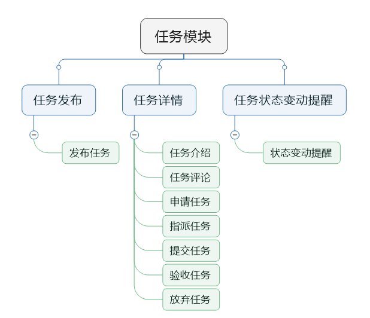

**H2H**

**软件设计说明**

西北工业大学H2H小组

**目录**

[H2H 1](#_Toc12946531)

[1.引言 3](#_Toc12946532)

>   [1.1.标识 3](#_Toc12946533)

>   [1.2.系统概述 3](#_Toc12946534)

>   [1.3文档概述 3](#_Toc12946535)

>   [1.4基线 3](#_Toc12946536)

[2.引用文件 4](#_Toc12946537)

[3.设计决策 4](#_Toc12946538)

[4.体系结构设计 6](#_Toc12946539)

>   [4.1.体系结构 6](#_Toc12946540)

>   [4.1.1程序(模块)划分 6](#_Toc12946541)

>   [4.2.全局数据结构说明 9](#_Toc12946542)

>   [4.2.1.常量 9](#_Toc12946543)

>   [4.2.2.变量 9](#_Toc12946544)

>   [4.2.3.数据结构 9](#_Toc12946545)

>   [4.3.数据库设计 12](#_Toc12946546)

>   [4.4.CSCI部件 12](#_Toc12946547)

>   [4.5.接口设计 13](#_Toc12946548)

>   [4.5.1.外部接口 13](#_Toc12946549)

>   [4.5.2.内部接口 14](#_Toc12946550)

[5.CSCI详细设计 20](#_Toc12946551)

>   [5.1.功能 20](#_Toc12946552)

>   [第一部分：系统管理员 20](#_Toc12946553)

>   [第二部分：图书管理员 26](#_Toc12946554)

>   [第三部分：读者 35](#_Toc12946555)

>   [5.2.性能 43](#_Toc12946556)

>   [5.3.输入项目 44](#_Toc12946557)

>   [5.4.输出项目 44](#_Toc12946558)

[6.需求可追踪性 44](#_Toc12946559)

[7.注解 44](#_Toc12946560)

**1.引言**

**1.1.标识**

H2H-Doc-SSD-v1.0

**1.2.系统概述**

我们的项目“H2H”是一个面向校内大学生的校内互助平台。旨在为大学生处理一些在时间、空间上冲突的活动。用户可以在该平台上发布自己急需完成但却因种种原因没空脱身、或者因为客观因素无法完成的事情作为任务。这时，有时间、精力或者同样也要做类似事情的用户可以在平台上进行“接受任务”操作，替该同学完成任务，并且进行相应对接。

为了鼓励用户积极参与到互助活动中，我们设计了积分奖励系统。任务发布者可以通过支付一定的积分进行“悬赏”，使自己的任务吸引到更多人的注意，得到更好、更快地解决。而完成对应任务的用户将获得相应的悬赏积分。此外，用户还可以通过每日签到获取少量积分。

为了提高任务完成质量，真正实现平台互帮互助的宗旨，系统还集成了评价系统。任务完成后，发布者和执行者都可以就这次任务的体验对任务进行评分和评价。任务记录以及对应的评价会展示在用户的个人信息页面中，评分将通过一定算法转化为用户的信用评分，展示在个人信息页面中。在任务领取与指派的过程中，用户可以根据这些信息判断对方的可信程度。

**1.3文档概述**

本文档描述了H2H系统计算机软件配置项的设计。它描述了CSCI级设计决策、CSCI体系结构设计(概要设计)和实现该软件所需的详细设计。

**1.4基线**

-   《H2H软件开发计划》

**2.引用文件**

-   《H2H软件需求说明书》

-   《H2H软件开发计划》

**3.CSCI设计决策**

H2H系统面向系统中的信息交互主体，被划分为三个模块：“系统管理员模块”、“用户模块”和“任务模块”。

1.  系统管理员模块

>   系统管理员模块仅向本系统的管理者开放，拥有系统的最高权限，通过特殊的链接入口进入。该模块包含三个小模块：“用户管理模块”、“任务管理模块”和“系统管理模块”。

-   用户管理模块实现了对用户的统一管理。主要功能包括：

    -   删除无效用户。无效用户主要指已毕业的学生或在发布、执行任务中多次出现恶意破坏行为的用户。

    -   封锁用户账号。当用户出现轻微违规行为，管理员可以通过在一段时间内限制其使用作为惩罚措施。

    -   搜索用户。系统管理员可以通过用户的账户、姓名来搜索需要管理的用户。

    -   筛选用户。管理员可以通过用户管理列表提供的滤波器筛选被封号中的用户账户。

    -   积分更改。管理员可以更改用户的积分值。主要用于用户违规行为的惩罚措施以及当系统出现问题时的修复措施。

-   任务管理模块实现了管理员对任务的审核以及其他管理功能，主要包括：

    -   审核用户提交的任务。

    -   删除审核通过后违规的任务。

    -   通过关键词、用户账户搜索需要管理的任务。

    -   筛选任务。管理员可以通过任务状态、任务发布日期筛选任务列表，进而方便其管理。

-   系统管理模块负责管理管理所有可供修改的系统参数，包括：管理员账户密码、每日签到能获得的积分数目、放弃任务扣除的积分数目等。

1.  用户模块

>   用户模块主要面向系统用户，为用户行为提供接口。用户可以通过用户模块使用系统的账户管理、信息浏览、用户间交流、个人信息记录等功能。对应五个功能项分为五个模块：注册登陆模块、首页模块、私信模块、个人信息模块。

-   注册登陆模块为用户提供了注册新账户、使用已有账户登陆、忘记密码时找回密码的功能。注册新账户时要求用户填写基本信息，见4.2.1；用户登录时需要输入用户名和对应的密码；找回密码时需要输入待找回的账户。

-   首页模块是用户使用系统的主要模块之一，使用户与任务交互的主要场景。

    -   任务列表展示了当前已审核发布而未指派的任务。用户可以通过列表浏览任务的详细情形，决定是否申请执行该任务。任务列表也会提供筛选功能和搜索功能。按照任务的类型、发布时间、悬赏范围、热度、关键词进行筛选和搜索。

    -   首页模块包含了发布任务功能。使用户可以根据自己的需求发布任务，寻求其他用户的帮助。

    -   公告窗口向用户展示管理员发布的系统相关的通知。

-   私信界面提供了用户之间私下交流的功能。使用该功能用户可以自由交流任务信息与任务完成情况。

-   个人信息模块展示了用户的基本信息，包括用户的学号、姓名、发布任务数、完成任务数、放弃任务数）、个人信誉、积分等。个人信息页面还展示了用户的任务列表，包括发布的任务、完成的任务。个人信息模块还提供修改用户密码的功能。

1.  任务模块

>   任务模块提供了以任务为中心的一系列功能。主要包含了任务发布模块、任务展示与操作模块。

-   任务发布模块填写任务的基本信息，包括标题、描述、类型、悬赏、有效截止时间等。用户可以通过这个界面提交一个任务。待管理员审核后发布到系统中。

-   任务展示与任务操作模块使用户可以浏览一个任务的详细信息，并在任务的不同阶段对任务进行评论、申请、指派、提交、验收或放弃。

**4.体系结构设计**

**4.1.体系结构**

**4.1.1程序(模块)划分**

H2H系统被划分为三个面向用户的模块：“系统管理员模块”、“用户模块”和“任务模块”。

-   系统管理员模块HIPO图

-   用户模块HIPO图

-   任务模块HIPO图

**4.2.全局数据结构说明**

**4.2.1.常量**

1.  用户：用户编号，学号，密码，联系方式，用户邮箱，姓名；

2.  管理员：密码；

3.  系统参数：每日签到积分值；

4.  任务：任务编号，标题，描述，类型，悬赏，发布时间，截止时间，发布人，领取人；

5.  公告：公告编号，标题，内容，时间；

6.  消息：消息编号，发送人，接收人，内容，时间；

7.  评论：评论编号，发布人，内容，关联的任务，时间；

    **4.2.2.变量**

8.  系统管理员、用户登录所需的密码；

9.  用户的个人信誉（评分），密码，任务列表，积分，消息列表，发布任务数、完成任务数、放弃任务数；

10. 消息状态（未读，已阅）；

11. 任务状态（未审核，已发布，执行中，已提交，已验收，已失效），任务申请人列表；

12. 用户和管理员的各种输入；

13. 数据库各类信息和状态；

    **4.2.3.数据结构**

**系统管理员 =密码**

**用户 =学号**

>   **+密码**

>   **+联系方式**

>   **+用户邮箱**

>   **+个人信誉（评分）**

>   **+姓名**

>   **+任务列表**

>   **+积分**

>   **+消息列表**

>   **+发布任务数、完成任务数、放弃任务数**

个人信誉=\*根据过去任务完成评价产生的信誉评分\*

任务列表=\*用户自己维护的跟自身有关的任务列表\*

积分=\*用户通过接收完成任务获得的分数，可以用来委托他人完成任务\*

消息列表=\*用户收到的消息的表格\*

发布任务数、完成任务数、放弃任务数=\*用户发布，完成，放弃的任务数量\*

**任务 =任务编号**

>   **+标题**

>   **+描述**

>   **+类型**

>   **+悬赏**

>   **+发布时间**

>   **+截止时间**

>   **+发布人**

>   **+申请人列表**

>   **+领取人**

>   **+状态**

描述=\*任务描述\*

类型=\*任务所属类型\*

悬赏=\*完成该任务能得到的积分\*

申请人列表=\*申请人形成的列表\*

状态=\*任务目前状态，总共有未审核，已发布，执行中，已提交，已验收，已失效六种\*

时间格式：“YYYY-MM-DD hh-mm-ss”

**评论 =任务编号**

>   **+内容**

**+关联的任务**

**+时间**

**+发布人**

关联的任务=\*在该任务下被评论\*

时间格式：“YYYY-MM-DD hh-mm-ss”

**公告 =公告编号**

>   **+标题**

**+内容**

**+时间**

时间格式：“YYYY-MM-DD hh-mm-ss”

**消息 =消息编号**

>   **+发送人**

**+接收人**

**+内容**

**+时间**

**+状态**

状态=\*消息目前状态，总共有未读，已阅两种\*

时间格式：“YYYY-MM-DD hh-mm-ss”

**4.3.数据库设计**

**4.4.CSCI部件**

-   系统管理员模块调用：

1.  用户管理模块

2.  系统参数管理模块

3.  任务管理模块

-   用户模块调用：

1.  系统模块

2.  首页模块

3.  私信模块

4.  个人信息模块

-   任务模块调用：

1.  任务发布模块

2.  任务详情模块

3.  任务状态变动提醒模块

    **4.5.接口设计**

    **4.5.1.外部接口**

-   用户界面布局：

**一、系统管理员页面**

1.  系统管理员页面应使用列表展示用户信息。列表应附有筛选和搜索功能。同时列表支持对部分表项数据中进行修改，比如是否封号。

2.  系统管理员页面应使用列表展示任务信息。列表应附有筛选和搜索功能。同时列表支持对部分表项数据进行修改，比如是否删除。

3.  系统管理员页面应展示系统运行状况，包括数据库状态、各终端设备状态以及网络链接状态等。

4.  系统管理员页面应提供修改各类系统参数的选项卡。

**二、用户页面**

1.  用户页面应用两个列表分别展示当前已经完成任务信息以及等待完成任务信息。列表应附有筛选和搜索功能。

2.  用户页面展示用户的账号，现有积分基本信息。

3.  用户页面提供去往任务界面通道。

4.  用户页面支持对个人基本信息进行修改。

5.  用户页面设有窗口供用户发送评价和消息。

**三、任务界面**

>   1. 任务页面展示任务的状态、发布人、描述等基本信息。

>   2. 任务页面提供任务分类浏览、筛选以及搜索功能。

>   3. 任务页面提供任务领取按钮。

4. 任务页面提供任务验收按钮。

5. 任务页面提供任务评价按钮。

6. 任务页面提供任务指派按钮。

7. 任务页面提供任务放弃按钮。

>   3. 任务页面提供任务发布按钮。

>   8. 任务页面支持任务状态变更提醒。

-   软件接口：

1.  系统数据库：用于系统参数、用户和任务的信息以及入库图书资料。

2.  操作系统：Windows10。

-   通信接口：

1.  网络通信标准或协议：客户端和服务器端的通信遵循TCP/IP协议。

2.  通信安全或加密问题：采用中等级别的加密算法保证用户的通信安全。

    **4.5.2.内部接口**

**5.CSCI详细设计**

**5.1.功能**

**第一部分：**

**5.2.性能**

1.  空间占用：

Web程序安装前安装包大小不大于200M，解压安装后对于Windows系统的磁盘空间占用量不超过500M。数据库空间占用量根据图书馆用户数量而定，在一个表数据长度达到18000时占用内存为2M，达到33139时占用内存为4M，达到44000时占用内存为8M，达到87809时占用内存为16M。

1.  资源占用：

在80%的用户使用时间内，对于ARM处理器的率不超过30%，对于RAM的占用量不超过10M。

1.  功耗：

后台运行状态下，本程序对于Windows系统的耗电量平均每天不超过10%。

1.  安全性能：

2.  用户在注册时，必须设置他的电子邮箱，作为找回密码等敏感操作的验证工具。

3.  用户在修改密码、修改找回密码问题与回答时，系统应向用户电子邮件验证码，来确保操作的安全性。

4.  服务器保存所有用户操作记录，以供用户可以查询自己和他人先前历史操作。

5.  灵活性：页面响应绝大部分的操作。

6.  时间特性：响应点击按钮，页面间跳转的时长在0.5\~1秒之间。

    **5.3.输入项目**

输入的数据是户执行的各种操作，包括点击按钮，键盘输入等操作。

**5.4.输出项目**

输出是从数据库中读取的数据，或错误警告信息。

**6.需求可追踪性**

**7.注解**

-   CSCI：计算机软件配置项

相关技术介绍：

-   基于Web的程序

>   应用程序有两种模式C/S、B/S。C/S是客户端/服务器端程序，也就是说这类程序一般独立运行。而B/S就是浏览器端/服务器端应用程序，这类应用程序一般借助IE等浏览器来运行。WEB应用程序一般是B/S模式。Web应用程序首先是“应用程序”，和用标准的程序语言，如C、C++等编写出来的程序没有什么本质上的不同。然而Web应用程序又有自己独特的地方，就是它是基于Web的，而不是采用传统方法运行的。换句话说，它是典型的浏览器/服务器架构的产物。

>   一个Web应用程序是由完成特定任务的各种Web组件（web
>   components)构成的并通过Web将服务展示给外界。在实际应用中，Web应用程序是由多个Servlet、JSP页面、HTML文件以及图像文件等组成。所有这些组件相互协调为用户提供一组完整的服务
